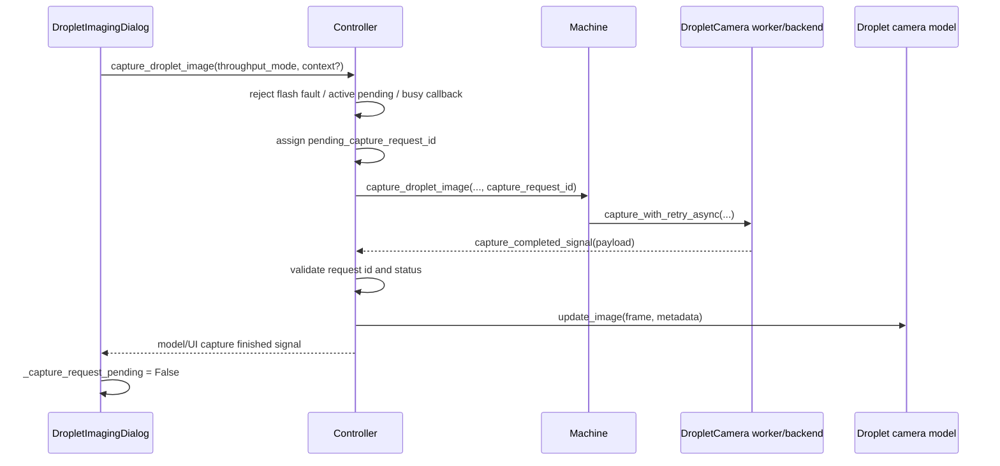
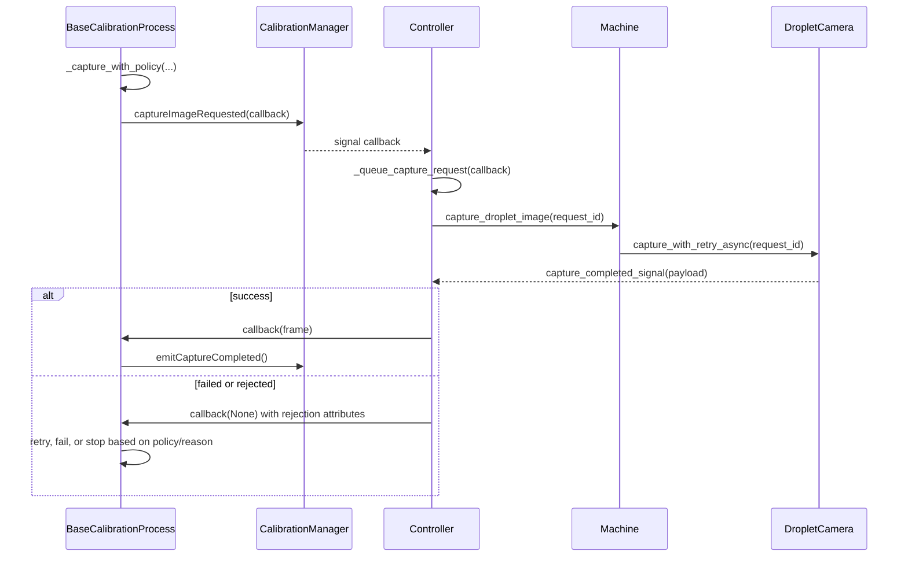
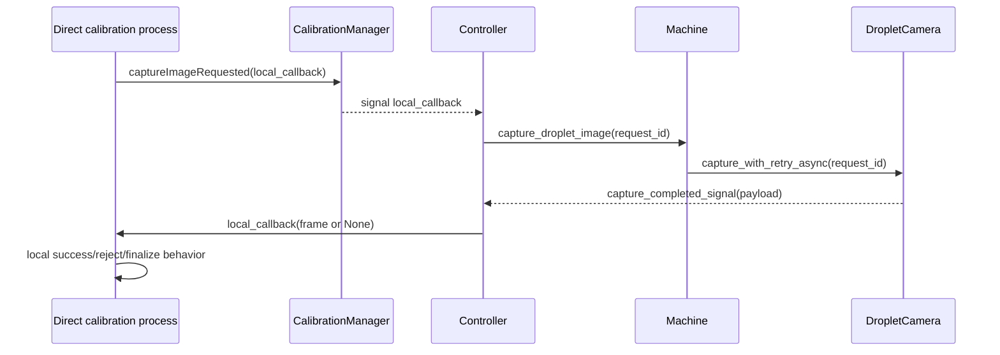
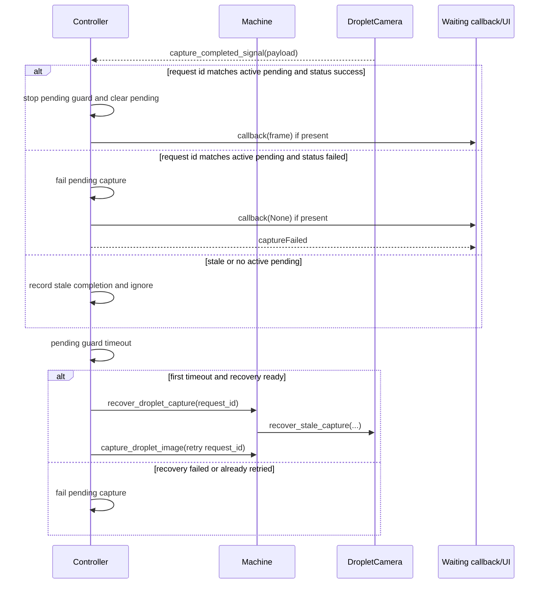
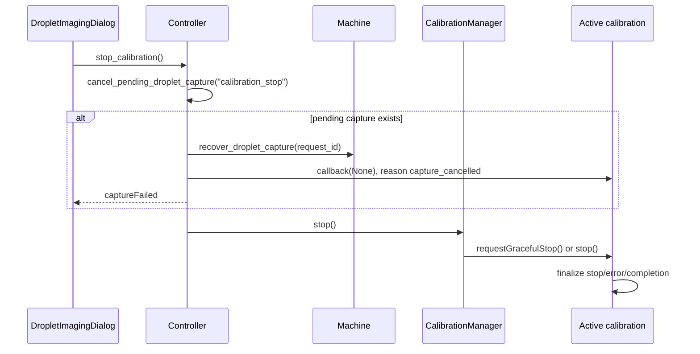
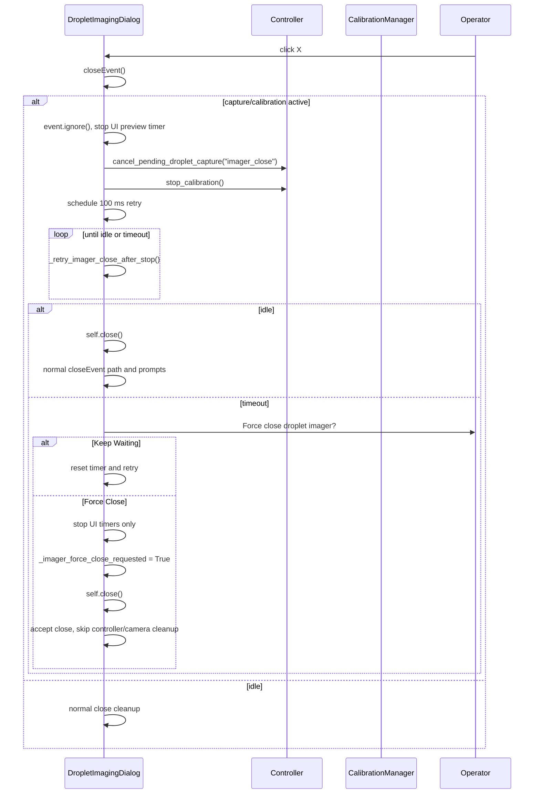

# Camera Capture Life-Cycle Map

> Current-state audit, not desired-state design.
>
> This document maps the droplet imager capture lifecycle as it exists after the
> recent capture-cancel, deferred-close, and force-close hardening. It is meant
> to make ownership, timeouts, cleanup, and failure paths visible before any
> larger refactor. It should not be read as a recommendation that the current
> layering or state ownership is ideal.

## Purpose and Scope

The droplet imager capture path crosses the Qt UI, `Controller`, calibration
processes, the machine camera worker/backend, GPIO-triggered capture recovery,
and firmware flash/trigger safety. Several recent fixes added bounded shutdown,
explicit capture cancellation, deferred close, and force-close fallback behavior.
Those are useful damage controls, but the next stability step is to map the
whole lifecycle so future work can reduce one-off patches and latched states.

Scope:

- Python droplet imager UI and close behavior in
  `FreeRTOS-interface/CalibrationClasses/View.py`.
- Controller pending-capture ownership and capture routing in
  `FreeRTOS-interface/Controller.py`.
- Calibration capture callbacks and stop behavior in
  `FreeRTOS-interface/CalibrationClasses/Model.py`.
- Machine camera worker, backend recovery, and capture result signaling in
  `FreeRTOS-interface/Machine_FreeRTOS.py`.
- Firmware flash/trigger state in `firmware/Core/Src/Orchestrator.cpp`,
  `firmware/Core/Inc/Orchestrator.h`, `firmware/Core/Src/FlashSafety.cpp`,
  `firmware/Core/Inc/FlashSafety.h`, and `firmware/Core/Src/Printer.cpp`.
- Behavioral anchors in `tests/test_optics_capture_metadata.py`,
  `tests/test_droplet_camera_trigger_cleanup.py`,
  `tests/test_flash_safety_ui.py`, and
  `firmware/tests_host/tests/test_flash_safety.cpp`.

Out of scope:

- Firmware, protocol, motion, pressure, or camera backend changes.
- A replacement design for the capture stack.
- Any recommendation that requires changing command formats or firmware parsing.

## Ownership Map

| Layer | Owned state | Main symbols | Normal owner responsibility | Cross-layer risk |
| --- | --- | --- | --- | --- |
| Droplet imager UI | Visible capture buttons/status, preview timer, local pending request, close/deferred-close/force-close flags, refuel UI timers | `DropletImagingDialog.capture_image`, `capture_optics_frame`, `_capture_request_pending`, `camera_timer`, `_request_imager_close_after_capture_stop`, `_retry_imager_close_after_stop`, `_request_imager_force_close`, `closeEvent` in `View.py` | Prevent duplicate UI capture requests, display status, stop UI timers, defer or force-close the imager shell | UI can be waiting on Controller/calibration state it does not own; force-close intentionally skips controller/camera cleanup |
| Controller | Single pending droplet capture, request id, callback, pending guard timer, recovery attempts, rejection/cancel reason tags | `Controller.capture_droplet_image`, `_queue_capture_request`, `handle_capture_request`, `cancel_pending_droplet_capture`, `_on_pending_capture_timeout`, `_on_capture_completed_payload`, `_fail_pending_capture`, `stop_calibration` in `Controller.py` | Serialize droplet capture requests, map worker payloads to model/callbacks, timeout/recover/cancel pending work | Callback uses `None` plus ad hoc attributes for failure reason; Controller must reject late/stale worker completions |
| Calibration manager/processes | Active calibration, queue state, capture retry policy, active timers, stop/finalization | `CalibrationManager.stop`, `BaseCalibrationProcess._capture_with_policy`, direct `captureImageRequested` emissions in `Model.py` | Decide when a calibration needs a frame, retry policy, terminal stop/error/completion state | Some direct capture paths bypass `_capture_with_policy`, so cancellation/retry semantics are not completely centralized |
| Machine camera | Camera object, worker thread latch, backend object, capture generation, GPIO trigger wait state | `DropletCamera.capture_with_retry_async`, `capture_with_retry_sync`, `recover_stale_capture`, `_replace_capture_backend`, `Machine.capture_droplet_image`, `Machine.recover_droplet_capture` in `Machine_FreeRTOS.py` | Start async worker, wait for trigger/frame, emit payload, recover stale worker/backend state | Worker thread and Qt thread share completion by signals; backend recovery can be invoked while stale worker is still unwinding |
| Firmware flash/trigger | Flash session armed/fault state, trigger ISR events, ACK/print-completion timers, final-droplet flash flag | `FlashSafety`, `Orchestrator::flashNotifyFromISR`, `Orchestrator::_flashTaskLoop`, `Orchestrator::_latchFlashFault`, `Printer::setFlashOnLast`, `Printer::_flashOnLast` | Enforce flash safety, reject unsafe trigger states, latch faults, pulse flash at the intended print/capture point | Firmware latch is independent of Python pending-capture state; Python must notice and block/recover UI expectations separately |

## Primary Call Paths

### 1. Manual Preview And Optics Capture

Entrypoints:

- `DropletImagingDialog.capture_image` in
  `FreeRTOS-interface/CalibrationClasses/View.py`.
- `DropletImagingDialog.capture_optics_frame` in
  `FreeRTOS-interface/CalibrationClasses/View.py`.

Context:

- Starts on the Qt UI thread from a button/timer action.
- Camera work runs in a background worker created by `DropletCamera`.
- Completion returns through Qt signals into `Controller` and then model/UI
  observers.

Request id, callback, signal:

- Manual preview normally does not pass a calibration callback.
- Optics capture may pass `capture_context="optics_scale_bar"`.
- `Controller._queue_capture_request` assigns `pending_capture_request_id`.
- `DropletCamera.capture_completed_signal` returns a payload that should carry
  the same request id.

State mutations:

- UI sets `_capture_request_pending = True` after a queued request.
- Controller sets `pending_capture_active`, `pending_capture_context`,
  `pending_capture_request_id`, `pending_capture_started_monotonic`, and starts
  the pending guard timer.
- Machine sets `_capture_worker_active` and advances capture generation.
- On success, Controller updates `droplet_camera_model` and clears pending
  capture state. UI capture-finished/failed handlers clear local pending state.

Timeout or retry behavior:

- Controller pending guard defaults to 8000 ms, or 1500 ms in throughput mode.
- Machine strict capture uses more attempts and longer waits than throughput
  capture through `Machine.capture_droplet_image`.
- Machine retry behavior lives in `DropletCamera.capture_with_retry_sync`.

Cleanup behavior:

- Success path clears Controller pending state and worker latch.
- Failure path emits `captureFailed`, clears Controller pending state, and clears
  UI local pending state.
- A stale completion with the wrong request id is ignored by Controller.

Known risk or ambiguity:

- UI has a local duplicate-request guard, Controller has the authoritative
  pending guard, and Machine has a worker latch. These are related but not a
  single state machine.
- Manual preview completion depends on model/UI signal propagation rather than a
  local request callback.

### 2. Calibration Capture Via `_capture_with_policy`

Entrypoint:

- `BaseCalibrationProcess._capture_with_policy` in
  `FreeRTOS-interface/CalibrationClasses/Model.py`.

Context:

- The calibration process runs in the Qt/event-loop model layer and emits a
  request signal.
- Controller handles the request on the Qt side and delegates camera work to the
  Machine worker.
- The callback passed to `captureImageRequested` is the calibration process'
  wait point.

Request id, callback, signal:

- Calibration emits `CalibrationManager.captureImageRequested(callback)`.
- `Controller.handle_capture_request` forwards to `Controller.capture_droplet_image`.
- Controller stores the callback in `pending_capture_callback`.
- Machine payload request id is compared against `pending_capture_request_id`.

State mutations:

- Calibration starts a guard timer and records capture attempt state.
- Controller sets pending capture state and starts its own guard timer.
- Machine sets worker/backend capture state.
- On frame success, calibration records the frame and emits capture-completed
  process events through `CalibrationManager.emitCaptureCompleted`.

Timeout or retry behavior:

- `_capture_with_policy` owns calibration-level retry attempts and guard timing.
- Controller owns queue/pending guard timeout and backend recovery.
- Machine owns per-attempt trigger/frame wait timeout.
- A `None` frame tagged with `_capture_rejection_reason == "capture_cancelled"`
  is terminal for `_capture_with_policy`; it does not retry explicit Stop/Close
  cancellations.
- Busy rejection reasons such as `controller_pending` or `camera_worker_active`
  can be retried without consuming the normal capture-attempt budget.

Cleanup behavior:

- Success clears calibration timers and advances the process.
- Terminal failure emits calibration error/failure and lets manager cleanup run.
- Explicit cancellation records a cancellation event and exits the retry loop.

Known risk or ambiguity:

- Retry ownership exists at three levels: calibration policy, Controller guard,
  and Machine worker attempts. These timeouts can interact in surprising ways.
- Failure reason is passed through callback attributes and `None`, not a typed
  result object.

### 3. Direct Calibration Capture Paths That Bypass `_capture_with_policy`

Entrypoints:

- Online stream single-flow and single-tail capture helpers in
  `FreeRTOS-interface/CalibrationClasses/Model.py`, including
  `_start_single_flow_capture` and `_start_single_tail_capture`.
- Other direct `captureImageRequested` emissions that provide their own callback
  instead of routing through `BaseCalibrationProcess._capture_with_policy`.

Context:

- Calibration model code emits the same `captureImageRequested` signal.
- Controller and Machine paths are the same after the signal is handled.
- Callback handling is owned by the specific calibration process, not by the
  shared policy helper.

Request id, callback, signal:

- The request still receives a Controller request id.
- The callback is usually a local `_finish(frame)` or method reference.
- The callback may emit `captureCompleted` even for a rejected/`None` capture,
  depending on that process' local logic.

State mutations:

- Controller and Machine state is identical to other capture requests.
- Calibration process-local state may record rejected capture metadata and still
  advance or finalize according to that process.

Timeout or retry behavior:

- These paths do not share `_capture_with_policy` retry classification.
- They rely on Controller/Machine timeouts and their own local callback logic.

Cleanup behavior:

- Controller cleanup remains centralized.
- Calibration cleanup is local to each direct path.

Known risk or ambiguity:

- Direct capture paths are the clearest remaining ownership split. They can
  behave differently from `_capture_with_policy` for cancellation, retries, and
  `None` frames.
- A future refactor should decide whether these paths need the same typed result
  and terminal-cancellation contract as `_capture_with_policy`.

### 4. Capture Success, Failure, And Stale Completion

Entrypoints:

- `Controller._on_capture_completed_payload`.
- `Controller._on_capture_failed`.
- `Controller._on_pending_capture_timeout`.
- `DropletCamera.capture_with_retry_async`.
- `DropletCamera.recover_stale_capture`.

Context:

- Machine worker completion is emitted back to Qt through signals.
- Controller validates request id and current pending state before accepting a
  worker payload.
- Recovery is initiated by Controller but implemented by Machine/Camera.

Request id, callback, signal:

- The payload request id must match `Controller.pending_capture_request_id`.
- A completion with no active pending request or a mismatched request id is
  stale and ignored for active calibration/UI state.
- On failure, callback receives `None` and may have rejection attributes.

State mutations:

- Worker sets and clears `_capture_worker_active`.
- Controller clears `pending_capture_active` and related fields when it accepts
  success/failure/cancellation.
- Recovery increments/invalidates camera generation and may replace the backend.

Timeout or retry behavior:

- First Controller pending timeout attempts recovery and one retry when the
  camera reports ready.
- A later timeout or unrecoverable camera state fails the pending request.
- Machine worker attempts are bounded by the mode-specific retry settings.

Cleanup behavior:

- Accepted success updates model image and metadata.
- Accepted failure emits `captureFailed`.
- Stale success/failure is recorded/ignored and should not call the waiting
  callback for a newer or cancelled request.
- `recover_stale_capture` attempts trigger-low cleanup, backend replacement, and
  worker join with a bounded wait.

Known risk or ambiguity:

- A late worker thread can still emit after Controller has cancelled or retried.
  Request id/generation checks are therefore essential.
- Backend recovery is a pragmatic cleanup path, not a complete ownership model.

### 5. Stop Calibration During Capture

Entrypoint:

- Stop button or UI close path calls `Controller.stop_calibration`.

Context:

- Starts on the Qt UI thread.
- It must release a calibration callback that may be waiting for a camera worker.

Request id, callback, signal:

- If `pending_capture_active` is true, `cancel_pending_droplet_capture` snapshots
  request/callback state.
- The callback is tagged with `_capture_rejection_reason = "capture_cancelled"`
  and receives `None`.
- Controller emits `captureFailed` when requested.

State mutations:

- Controller stops the pending guard timer and clears pending capture fields.
- Optional recovery calls `Machine.recover_droplet_capture`.
- Calibration manager then receives `stop()` and asks the active calibration to
  stop gracefully when supported.

Timeout or retry behavior:

- Cancellation is explicit and terminal for `_capture_with_policy`.
- It does not wait for the original worker completion before releasing the
  calibration process.

Cleanup behavior:

- Controller records capture-cancel diagnostics.
- Late worker completions should be stale and ignored.
- Calibration manager performs its existing stop/finalization path.

Known risk or ambiguity:

- Direct capture paths that bypass `_capture_with_policy` may interpret
  `callback(None)` differently.
- Recovery can still be interacting with a worker/backend while calibration
  state is already stopping.

### 6. Imager Close During Capture, Deferred Close, And Force Close

Entrypoint:

- `DropletImagingDialog.closeEvent` in
  `FreeRTOS-interface/CalibrationClasses/View.py`.

Context:

- Runs on the Qt UI thread.
- Normal close performs camera/controller cleanup only after capture/calibration
  state is idle.
- Deferred close avoids stacking synchronous camera shutdown on top of a stalled
  capture.

Request id, callback, signal:

- Deferred close calls
  `Controller.cancel_pending_droplet_capture("imager_close", emit_capture_failed=True, recover=True)`.
- Terminal calibration/capture signals schedule close retry.
- Force-close has no capture request id. It closes the UI shell only.

State mutations:

- Deferred close sets `_imager_close_after_stop_requested`,
  `_imager_close_after_stop_started_monotonic`, `_imager_close_retry_count`, and
  `_stream_capture_dialog_closing`.
- It stops `camera_timer`, clears `_capture_request_pending`, and requests
  capture cancellation/calibration stop.
- Force-close sets `_imager_force_close_requested`, stops UI timers only, clears
  `_capture_request_pending`, sets `capturing = False`, and calls `self.close()`.

Timeout or retry behavior:

- Deferred retry runs every 100 ms while calibration/capture remains active.
- After `IMAGER_CLOSE_STOP_TIMEOUT_S`, the UI prompts:
  `Force close droplet imager?`
- `Keep Waiting` resets the deferred timer and resumes retrying.
- `Force Close` closes only the imager UI shell and warns the operator to close
  and reopen the app before using the imager again.

Cleanup behavior:

- Normal close path still prompts for unapplied calibration and then runs
  bounded image-save shutdown, refuel monitor cleanup, capture profile reset,
  command dispatch interval reset, `stop_droplet_camera`, read-camera disable,
  and print-profile disable.
- Force-close close path accepts the event, resets deferred flags, keeps
  `_stream_capture_dialog_closing = True`, and skips controller/camera cleanup,
  including `stop_droplet_camera`.

Known risk or ambiguity:

- Force-close intentionally leaves lower layers potentially dirty so the user
  can escape the imager window. The operator must close and reopen the app
  before using the imager again.
- The UI close state is now a safety shell around lower-layer cleanup, not the
  authoritative capture owner.

## Firmware Flash And Trigger Path

Entrypoints:

- `Orchestrator::flashNotifyFromISR` in
  `firmware/Core/Src/Orchestrator.cpp`.
- `Orchestrator::_flashTaskLoop` in
  `firmware/Core/Src/Orchestrator.cpp`.
- `Printer::setFlashOnLast` and the final-droplet flash handling in
  `firmware/Core/Src/Printer.cpp`.

Context:

- Trigger line changes arrive through interrupt context and notify the flash
  task.
- The flash task and print task coordinate through firmware state, not through
  the Python pending-capture state.

Request id, callback, signal:

- Firmware trigger/flash state does not know the Python capture request id.
- Python observes firmware flash fault state through Controller/model/UI status
  and blocks capture when a flash fault is latched.

State mutations:

- `FlashSafety` tracks armed/disarmed, awaiting release, busy, and fault-latched
  states.
- `Orchestrator::_latchFlashFault` records flash fault reason and disarms
  unsafe triggering.
- `Printer::_flashOnLast` is set by `Printer::setFlashOnLast(true)` and cleared
  after firing on the final droplet.

Timeout or retry behavior:

- Firmware tracks flash ACK timeout and print-completion timeout through
  orchestrator timing fields.
- Fault conditions are latched rather than retried inside Python capture logic.

Cleanup behavior:

- Firmware transitions to safe flash output state when disarmed/faulted.
- UI/controller code treats a latched flash fault as a capture-blocking state.

Known risk or ambiguity:

- Python can clear/cancel its own pending capture without clearing a firmware
  flash fault latch. These are separate ownership domains.
- A root-cause refactor should preserve this separation while making the Python
  capture result explicitly carry "firmware fault/blocked" status.

## State And Timeout Inventory

| State / timer / id | Location | Set by | Cleared by | Timeout / bound | If stale |
| --- | --- | --- | --- | --- | --- |
| `_capture_request_pending` | `DropletImagingDialog` in `View.py` | `capture_image`, `capture_optics_frame`, deferred close cleanup | UI capture finished/failed handlers, deferred/force close | No independent timeout | UI can block new button captures even if Controller has already recovered unless failure/close handlers clear it |
| `camera_timer` | `DropletImagingDialog` | Live preview start/resume logic | Close/deferred-close/force-close paths | Qt timer interval | Can keep requesting preview frames while calibration/close is trying to stop if not stopped first |
| `_imager_close_after_stop_requested` | `DropletImagingDialog` | `_request_imager_close_after_capture_stop` | Idle close retry or timeout/force-close reset | 100 ms retry loop | Can keep re-entering close retry until bounded timeout |
| `_imager_close_after_stop_started_monotonic` | `DropletImagingDialog` | First deferred close request or Keep Waiting reset | Reset deferred flags | `IMAGER_CLOSE_STOP_TIMEOUT_S` | Defines when the force-close prompt appears |
| `_imager_close_retry_count` | `DropletImagingDialog` | Deferred close retry loop | Reset deferred flags | Diagnostic count only | Useful for diagnosing long cleanup waits |
| `_imager_force_close_requested` | `DropletImagingDialog` | `_request_imager_force_close` | Force-close `closeEvent` branch | No retry | Causes close to skip normal controller/camera cleanup |
| `_imager_force_close_prompt_active` | `DropletImagingDialog` | Timeout prompt | Prompt completion/reset | Prompt modal duration | Prevents multiple force-close prompts |
| `pending_capture_active` | `Controller` | `_queue_capture_request` | Success, fail, cancel, queue rejection | Controller guard timer | If not cleared, Stop/Close/calibration may believe a capture is still active |
| `pending_capture_request_id` | `Controller` | `_queue_capture_request` | Success, fail, cancel | Compared on worker completion | Stale worker payload is ignored when request id does not match |
| `pending_capture_callback` | `Controller` | Calibration `captureImageRequested` handling | Success, fail, cancel | Coupled to pending capture | Waiting calibration may hang if callback is not released |
| `pending_capture_guard_timer` | `Controller` | `_queue_capture_request` | Success, fail, cancel | 8000 ms default, shorter throughput guard | Timeout attempts recovery or fails pending capture |
| `pending_capture_recovery_attempted` | `Controller` | Timeout/recovery path | Pending clear | One Controller-level recovery attempt | Prevents unbounded retry after guard timeout |
| `_capture_rejection_reason` | Callback attribute in `Controller`/calibration | Queue reject, cancel, fail paths | Callback object lifetime | No timer | Ad hoc reason channel; easy to miss in direct capture paths |
| `_capture_worker_active` | `DropletCamera` in `Machine_FreeRTOS.py` | `capture_with_retry_async` | Worker finally/recovery | Worker wait and bounded recovery join | Blocks new camera work and can require backend recovery |
| Capture generation | `DropletCamera` | Async start/recovery/backend replace | Next generation update | No direct timeout | Prevents stale workers from completing newer requests |
| Backend object | `DropletCamera` | `start_camera`, `_make_capture_backend`, `_replace_capture_backend` | `stop_camera`, backend replacement | Backend-dependent | A stale/closed backend can reject new captures until replaced |
| `_cap_done` / capture wait state | `DropletCamera` backend path | Non-blocking capture start | Trigger/frame completion or recovery | Attempt timeout plus margin | A stalled trigger/frame wait causes worker to retry or fail |
| Calibration guard/retry timers | `BaseCalibrationProcess` | `_capture_with_policy` | Success, fail, stop/cancel | Policy-specific guard/attempts | Can retry around busy failures; explicit cancellation is terminal |
| Active calibration | `CalibrationManager` | Calibration start/queue logic | Completion, error, `stop()` | Process-specific | If stop does not finalize, UI close remains deferred |
| `FlashSafety` session/fault state | Firmware | Orchestrator flash arm/trigger/fault logic | Firmware clear/reset path | ACK and print-completion timeouts | Python captures are blocked while fault is latched |
| `Printer::_flashOnLast` | Firmware `Printer` | `Printer::setFlashOnLast(true)` | Final-droplet flash path | Print movement timing | A latched/mis-cleared firmware trigger state can decouple from Python capture expectations |

## Failure And Cleanup Matrix

| Scenario | Detection point | Cleanup path | User-visible result | Main risk |
| --- | --- | --- | --- | --- |
| Capture success | `Controller._on_capture_completed_payload` receives matching success payload | Clear pending, update model image/metadata, invoke callback with frame | Preview/calibration advances | Success may arrive late after a cancel; request id check must reject stale payload |
| Controller queue rejection | `Controller.capture_droplet_image` sees flash fault, active pending, or busy callback | Do not enqueue; tag callback failure reason when present | UI/calibration sees rejected capture/failure | Rejection reasons are ad hoc attributes |
| Machine queue rejection | `Machine.capture_droplet_image` or `DropletCamera.capture_with_retry_async` returns false | Controller classifies camera state, clears pending, invokes callback `None`, emits failure | UI status/captureFailed | Backend unavailable/worker active can look similar at UI level |
| Machine attempt timeout | `DropletCamera.capture_with_retry_sync` exhausts attempts | Worker emits failed payload or failure signal | Controller fails pending unless recovery path is active | Worker may still be unwinding when UI asks to stop/close |
| Controller pending timeout, first time | `_on_pending_capture_timeout` | `Machine.recover_droplet_capture`, then retry when ready | Usually invisible if retry succeeds | Recovery and retry add another owner of camera state |
| Controller pending timeout, repeated/unrecoverable | `_on_pending_capture_timeout` | Fail pending capture, callback `None`, emit `captureFailed` | Calibration/UI failure | Calibration may still decide whether to retry |
| Explicit Stop Calibration | `Controller.stop_calibration` | Cancel pending capture, recover backend, callback `None` with `capture_cancelled`, then manager stop | Stop should release UI instead of waiting for stalled worker | Direct capture paths may not share terminal cancel semantics |
| Imager close while capture active | `DropletImagingDialog.closeEvent` | Ignore event, cancel pending capture, stop calibration, retry close when idle | Window stays open while cleanup runs | Close waits on lower-layer state and must remain bounded |
| Deferred close timeout, Keep Waiting | `_retry_imager_close_after_stop` | Reset timer/count and resume retry loop | Status says still waiting | Operator can keep waiting through repeated windows |
| Deferred close timeout, Force Close | Timeout prompt in UI | Stop UI timers only, set force flag, close shell, skip controller/camera cleanup | Imager window closes; operator warned to restart app before reuse | Lower-layer camera/calibration state may remain dirty by design |
| Stale worker completion | Controller receives payload with no active pending or mismatched request id | Record/ignore, do not invoke callback | Usually not visible | Missing stale check would corrupt newer capture/calibration state |
| Backend recovery | Controller timeout/cancel calls Machine recovery | Trigger low, invalidate generation, wake wait state, join briefly, replace backend, optionally restart camera | May allow retry or clean cancel | Recovery is defensive cleanup, not a comprehensive state coordinator |
| Firmware flash fault latch | Firmware `FlashSafety`/`Orchestrator` latches fault; Python model reflects fault | Firmware disarms/safe-idles flash; Controller blocks capture | UI shows flash fault and capture is disabled/blocked | Python capture cancel does not clear firmware fault state |

## Findings And Next-Step Refactor Targets

Observed current-state findings:

- Capture ownership is split across at least four state machines: UI pending
  state, Controller pending request state, Machine worker/backend state, and
  firmware flash/trigger state.
- The Controller is the closest thing to an authoritative Python capture owner,
  but UI close behavior and calibration retry policy still maintain important
  independent state.
- `None` plus callback attributes is the current cross-layer failure contract.
  It works for recent cancellation fixes, but it is fragile and easy for direct
  capture paths to interpret differently.
- `_capture_with_policy` has the strongest capture retry/cancellation semantics.
  Direct calibration capture paths that emit `captureImageRequested` themselves
  are the main place where behavior can diverge.
- Backend recovery and force-close are escape hatches. They mitigate hung UI and
  stale camera state, but they do not remove the root cause of capture ownership
  being distributed.
- Firmware flash safety is correctly independent from Python capture state, but
  Python capture results do not currently appear to carry a typed "firmware
  fault" result distinct from camera busy, timeout, or cancellation.

Recommended future work, at a high level:

- Define a typed `CaptureResult` contract used by Controller callbacks,
  calibration policy, direct calibration paths, and UI status handling. It should
  distinguish success, busy, timeout, explicit cancellation, stale completion,
  backend recovery failure, and firmware flash fault.
- Move capture request lifecycle ownership into a single Python coordinator
  owned by the Controller layer or below it. UI and calibration code should ask
  for capture and observe typed results rather than each maintaining partial
  pending state.
- Route direct calibration capture paths through the same policy/result contract
  as `_capture_with_policy`, or explicitly document why they are different.
- Add state-machine tests around request id, cancellation, stale completion,
  recovery, and force-close interaction rather than testing only individual bug
  fixes.
- Add a diagnostic capture timeline/event log that joins UI request, Controller
  request id, Machine worker generation, backend recovery, and firmware flash
  fault status.

## Open Questions For Refactor

- Should the Controller expose one observable capture state object so the UI can
  stop maintaining `_capture_request_pending` independently?
- Should `CalibrationManager.captureImageRequested` move from callback-style
  `frame or None` to a typed result signal or future-like object?
- Which direct calibration capture paths are intentionally different from
  `_capture_with_policy`, and which are historical bypasses?
- Should backend recovery be moved off the UI thread or wrapped in a stricter
  bounded async operation?
- What is the user-visible distinction between camera timeout, firmware flash
  fault, explicit Stop, and force-close dirty shutdown?
- Which event should be considered the authoritative end of a capture: worker
  completion, Controller pending clear, calibration callback completion, or UI
  model update?

